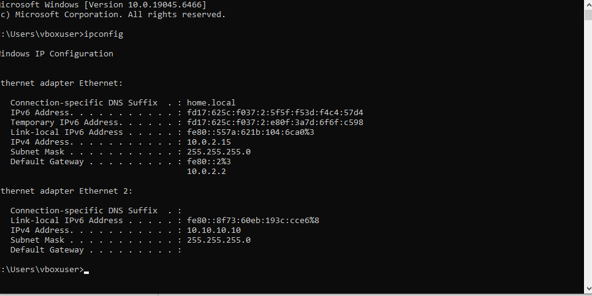
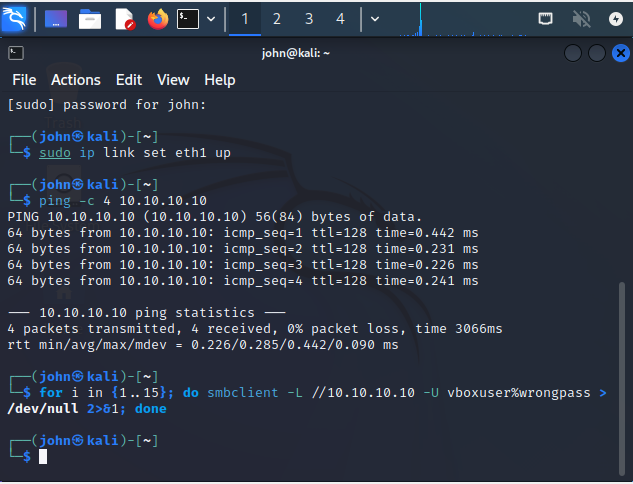
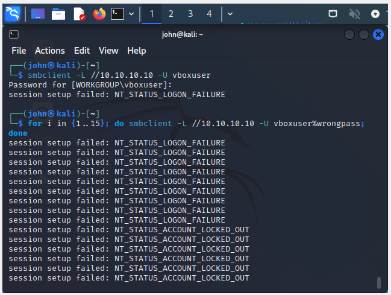
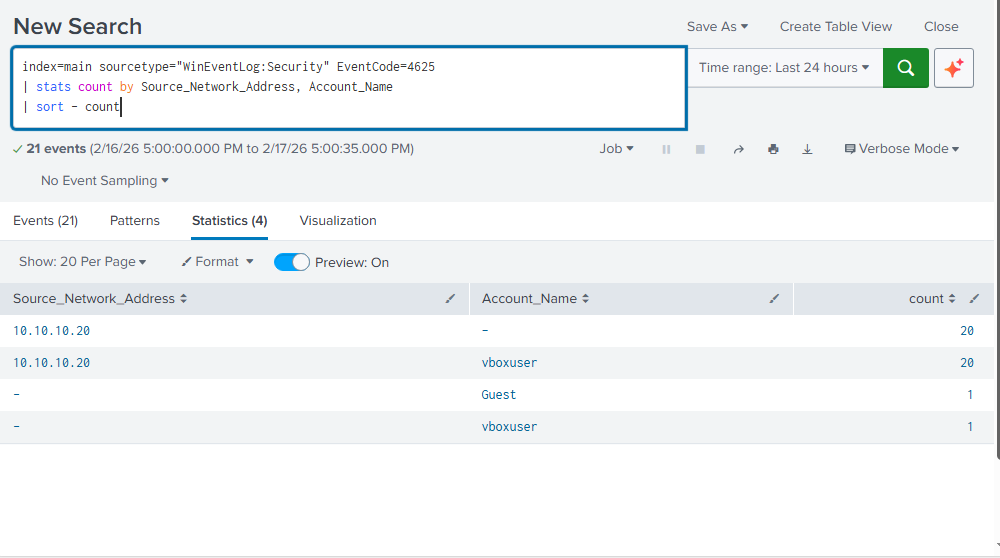
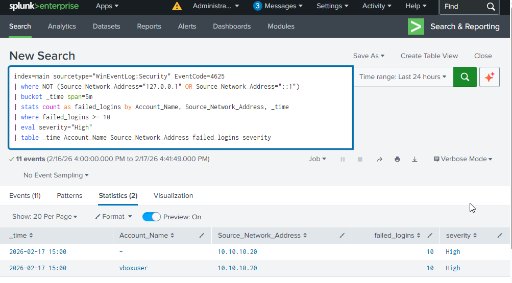
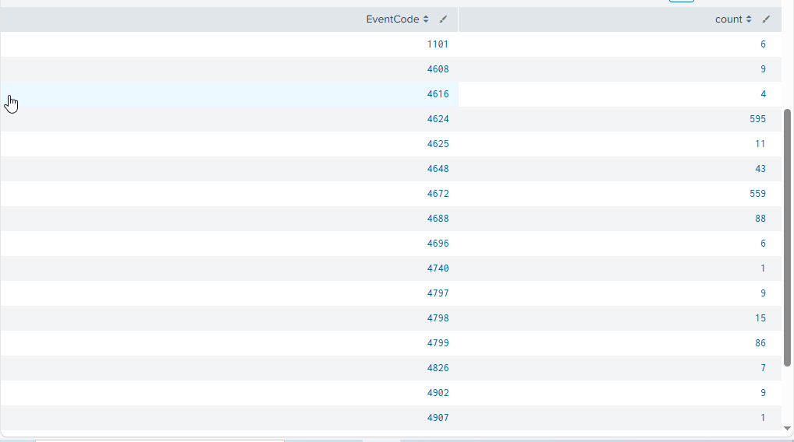
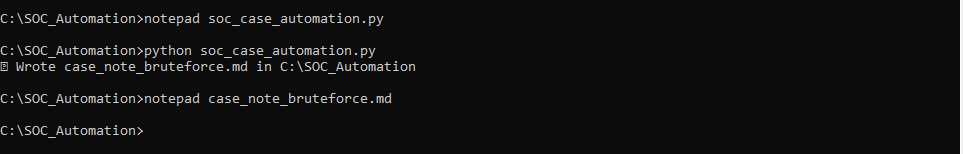
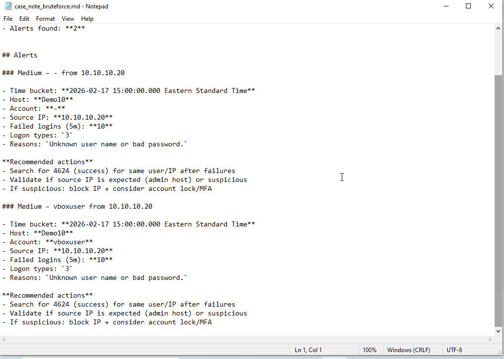

# soc-automation-splunk-bruteforce-lab
Simulated SMB brute-force attack → Splunk detection engineering → automated case note generation via Splunk REST API + Python.
# 🛡️ SOC Automation & Detection Engineering Lab  
### SMB Brute Force Simulation → Splunk Detection → Automated Case Triage

---

## 📌 Overview

This project simulates an SMB brute-force attack against a Windows host in an isolated lab environment. Logs were ingested into Splunk, analyzed using custom SPL logic, and automated case documentation was generated using Python via the Splunk REST API.

---

## 🧪 Lab Architecture

**Attacker:** Kali Linux  
**Victim:** Windows 10  
**SIEM:** Splunk Enterprise  
**Automation:** Python (Splunk REST API – Port 8089)  
**Network:** VirtualBox Host-Only Adapter  

---

# 1️⃣ Lab Network Configuration



---

# 2️⃣ Connectivity Validation



---

# 3️⃣ SMB Brute Force Simulation

```bash
for i in {1..15}; do smbclient -L //10.10.10.10 -U vboxuser%wrongpass; done
```



---

# 4️⃣ Log Analysis in Splunk

```spl
index=main sourcetype="WinEventLog:Security" EventCode=4625
| stats count by Source_Network_Address, Account_Name
| sort - count
```



---

# 5️⃣ Threshold-Based Detection Engineering

```spl
index=main sourcetype="WinEventLog:Security" EventCode=4625
| where NOT (Source_Network_Address="127.0.0.1" OR Source_Network_Address="::1")
| bucket _time span=5m
| stats count as failed_logins by Account_Name, Source_Network_Address, _time
| where failed_logins >= 10
| eval severity="High"
| table _time Account_Name Source_Network_Address failed_logins severity
```



---

# 6️⃣ Event Distribution

```spl
index=main sourcetype="WinEventLog:Security"
| stats count by EventCode
```



---

# 7️⃣ SOC Automation via Python

```bash
python soc_case_automation.py
```



---

# 8️⃣ Generated SOC Case Note



---

# 🧠 Skills Demonstrated

- Windows Security Event Analysis  
- Splunk SPL Detection Engineering  
- Threshold-Based Alert Logic  
- SMB Attack Simulation  
- REST API Integration  
- Python Automation  
- SOC Case Documentation Workflow  

---
